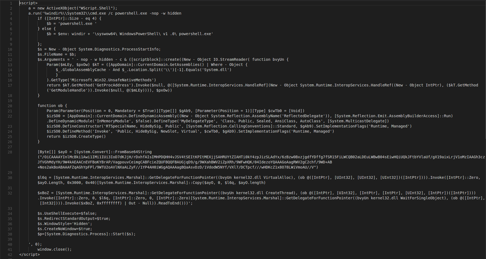
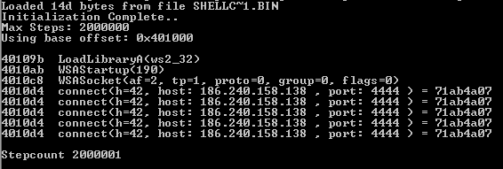

#### SHA256
b4204331c335c371b94d8bf819ef1108c8189758fbae5d82c3fce86fca041d18
#### MD5
d8baf80384b09927c8f6f4b21c387726
#### Filename
BancoContaGratis.hta (*English: Free Bank Account*)
#### First seen
2018-02-03 00:34:47 UTC

#### ANALYSIS NOTES
* ActiveX object being leveraged within a HTML script tag
* Execution of Powershell with encoded command arguments
* Indicative of [Powerfun Bind](https://researchcenter.paloaltonetworks.com/2017/03/unit42-pulling-back-the-curtains-on-encodedcommand-powershell-attacks/?adbsc=social70678766&adbid=840185525071826944&adbpl=tw&adbpr=4487645412)
* Indicative of [Rapid7 Rex Powershell Reflection template](https://github.com/rapid7/rex-powershell/blob/master/data/templates/to_mem_pshreflection.ps1.template)
* Network connection to 186.240.158.138:4444 (Telemar Norte Leste S.A.)

#### SCREENSHOTS

###### Decoded Powershell Powerfun Bind & Rex Powershell Reflection command arguments

###### Decoded shellcode embedded in Rex Powershell Reflection template
