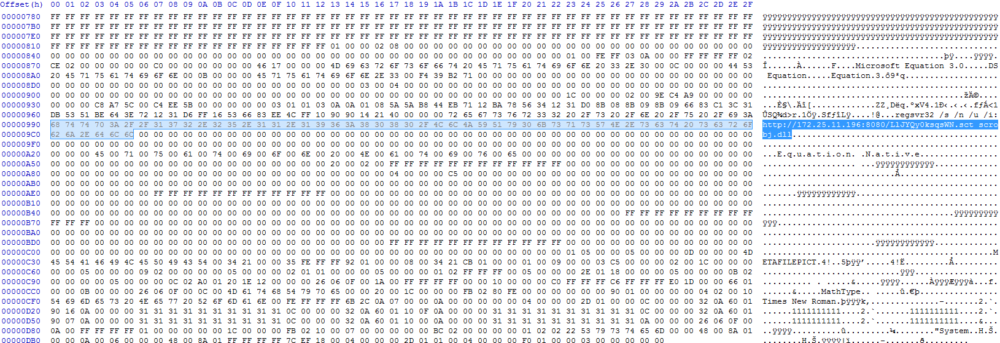

#### SHA256
466a13dbfa1fb176abda1577b0a4c69c23230246597c4724659d3e599659a057
#### MD5
2b3fad3bfe1fa2be4469bd1c64f59cad
#### Filename
HOLAS.doc (English: *Hellos*)
#### First seen
2018-01-24 09:41:59 UTC

#### ANALYSIS NOTES
* Submitted to VirusTotal from Mexico
* Office document leverages a vulnerability in Microsoft Equation Editor for code execution
* OLE object contains an URL *hxxp://172.25.11.196:8080/LlJYQy0ksqsWN.sct*
* Execution of Regsvr32 with command line arguments indicative of [App Locker Bypass](https://pentestlab.blog/2017/05/11/applocker-bypass-regsvr32/)
* [Link to VirusTotal](https://www.virustotal.com/en/file/466a13dbfa1fb176abda1577b0a4c69c23230246597c4724659d3e599659a057/analysis/)

#### SCREENSHOT

###### Evidence of CVE-2017-11882
